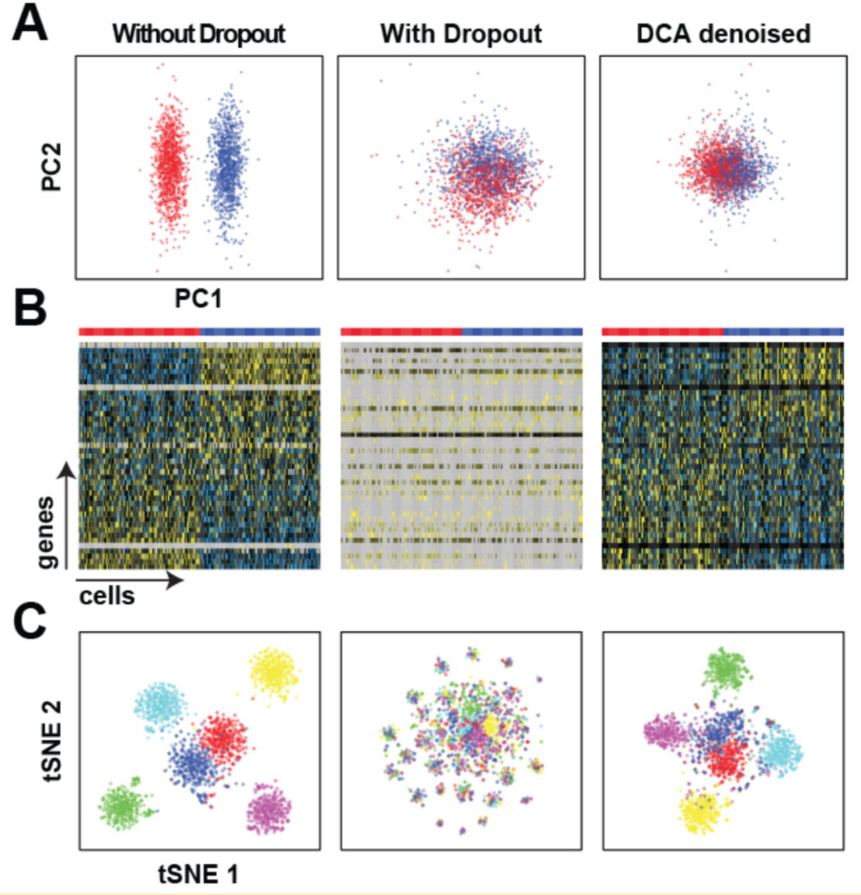

## Deep count autoencoder for denoising scRNA-seq data

A deep count autoencoder network to denoise scRNA-seq data and remove the dropout effect by taking the count structure, overdispersed nature and sparsity of the data into account using a deep autoencoder with zero-inflated negative binomial (ZINB) loss function.

### Installation

`pip install git+https://github.com/gokceneraslan/countae`

or you have `git` installed:

`git clone https://github.com/gokceneraslan/countae.git`

and then

`pip install -r requirements.txt -e .`

### Requirements

`Hyperopt` (from github master branch) and `kopt` packages are also required. Please run following commands as well:

`pip install git+https://github.com/hyperopt/hyperopt`

and

`pip install git+https://github.com/Avsecz/keras-hyperopt`

### Usage

You can run the autoencoder from the command line:

`autoencoder matrix.csv results`

where `matrix.csv` is a CSV/TSV-formatted raw count matrix with genes in rows and cells in columns. Cell and gene labels are mandatory. Results folder contains dropout, mean and dispersion matrices in TSV format. `mean.tsv` is the main output of the method.

Use `-h` option to see all available parameters and defaults.

### Hyperparameter optimization

Then run autoencoder with `--hyper` option do perform hyperparameter search.
